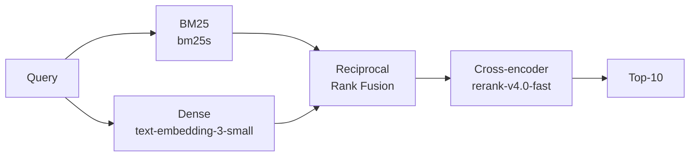

# XRAG - eXtended RAG

## References: 
- [The Complete Guide to Hybrid Search in RAG (BM25 + Embeddings + Reranker)](https://www.youtube.com/watch?v=XvKiTfd6Xvo)

- [FiQA-2018, a financial Q&A benchmark](https://sites.google.com/view/fiqa): I guess this would be a good benchmark to evaluate the XRAG system.
