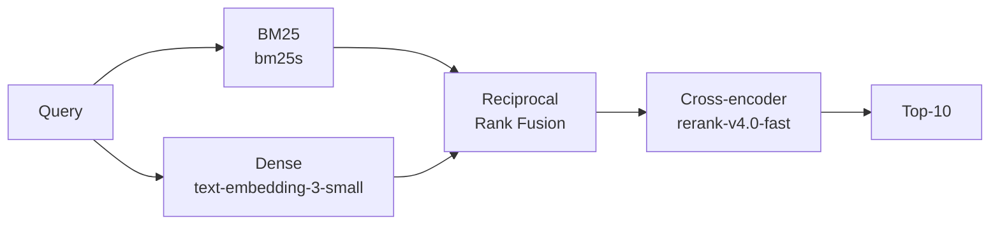

# XRAG - eXtended RAG

## Architecture

```mermaid
---
title: XRAG · Document-to-answer architecture
---
%%{init: {"theme": "base", "layout": "elk", "themeVariables": {"fontFamily": "Inter, ui-sans-serif, system-ui, sans-serif", "fontSize": "15px", "primaryTextColor": "#172033", "lineColor": "#64748b", "edgeLabelBackground": "#ffffff", "clusterBkg": "#f8fafc", "clusterBorder": "#cbd5e1"}, "flowchart": {"curve": "basis", "nodeSpacing": 32, "rankSpacing": 58, "padding": 18, "htmlLabels": true, "wrappingWidth": 380, "minNodeWidth": 260}, "elk": {"preset": "modelOrder", "mergeEdges": false}, "themeCSS": ".cluster rect { rx: 12px; ry: 12px; } .node rect { rx: 8px; ry: 8px; } .cluster-label .nodeLabel { font-weight: 600; } .edgeLabel { font-size: 13px; }"}}%%
flowchart TB
    accTitle: XRAG system architecture
    accDescr: Full document storage, asynchronous ingestion, retrieval and question answering architecture, including direct calls to parsing, embedding, vector database and chat services.
    CLIENT(["CLIENT<br/>Upload documents · Search · Ask questions"])
    API["<b>FASTAPI · :8000</b><br/>Storage routes · Jobs route · Retrieval route · Q&amp;A route"]
    CLIENT -->|"HTTP requests / responses"| API

    subgraph STORAGE["① DOCUMENT STORAGE · API service + object store"]
        direction TB
        S3["<b>S3StorageService</b><br/>Upload / download · boto3<br/>Updates manifest on artifact writes"]
        RUSTFS[("<b>RustFS · :9000</b><br/>S3-compatible object storage<br/>Persistent volume: rustfs_data")]
        ARTIFACTS["<b>Document artifacts</b><br/>workspace_id / document_id /<br/>raw · parsed.json · chunks.json · manifest.json"]
        S3 <-->|"S3 API · read / write"| RUSTFS
        RUSTFS --- ARTIFACTS
    end

    subgraph INGEST["② BACKGROUND INGESTION · asynchronous"]
        direction TB
        TEMPORAL["<b>Temporal server · :7233</b><br/>Task queues · Workflow history · Retries<br/>UI :8233 · Persistent volume: temporal_data"]
        subgraph WORKER["SEPARATE WORKER CONTAINER · ingest-worker"]
            direction TB
            WORKFLOW["<b>IngestionWorkflow</b><br/>Schedules activities in order<br/>3-minute timeout per activity attempt"]
            PARSE["<b>1 · Parse activity</b><br/>Read raw document<br/>Parse into Markdown pages · Save parsed.json"]
            CHUNK["<b>2 · Chunk activity</b><br/>Read parsed.json · LlamaIndex<br/>512 tokens / 50 overlap · Save chunks.json"]
            EMBED["<b>3 · Embed + index activity</b><br/>Read chunks.json · Batches of 32<br/>Embed text · Upsert vectors and payload"]
            WORKFLOW --> PARSE --> CHUNK --> EMBED
        end
        TEMPORAL <-.->|"Worker polls tasks / reports results"| WORKFLOW
    end

    subgraph RAG["③ LIVE RETRIEVAL & QUESTION ANSWERING · API services"]
        direction TB
        subgraph RETRIEVAL["RetrievalService · shared by search and Q&A"]
            direction TB
            QUERY["<b>1 · Embed query</b><br/>Question / search text → query vector"]
            SEARCH["<b>2 · Vector search</b><br/>Query vector → cosine top-k search"]
            SNIPPETS["<b>3 · Retrieved snippets</b><br/>Text · Similarity score · Metadata<br/>Default top-k: 5"]
            QUERY --> SEARCH --> SNIPPETS
        end
        RESULTS(["SEARCH RESPONSE<br/>List of snippets"])
        QNA["<b>QnAService</b><br/>Question + retrieved text + instructions<br/>Build grounded prompt"]
        ANSWER(["Q&A RESPONSE<br/>Generated answer text"])
        SNIPPETS -->|"/r/retrieve"| RESULTS
        SNIPPETS -->|"/q/ask"| QNA
        QNA --> ANSWER
    end

    subgraph SERVICES["④ SERVICE RUNTIME · each box has its own responsibility"]
        direction LR
        subgraph PARSING["A · DOCUMENT PARSING"]
            LITE["<b>LiteParse · :5707</b><br/>HTTP POST /parse<br/>Document bytes → Markdown pages<br/>Caller: Parse activity"]
        end
        subgraph EMBEDDINGS["B · SHARED EMBEDDING MODEL"]
            OLLAMA["<b>Ollama · :11434</b><br/>HTTP POST /api/embed<br/>Text → numeric vectors · Model cache: ollama_data<br/>Callers: Embed activity + RetrievalService"]
        end
        subgraph INDEX["C · VECTOR DATABASE"]
            QDRANT[("<b>Qdrant · :6333</b><br/>Cosine similarity · Configured collection<br/>Vectors + chunk text + source metadata<br/>Persistent volume: qdrant_data")]
        end
        subgraph GENERATION["D · ANSWER GENERATION"]
            CHAT["<b>Configured chat endpoint</b><br/>Responses API · CHAT_MODEL_BASE_URL<br/>Question + context → answer text<br/>Caller: QnAService"]
        end
    end

    API -->|"/s/upload · /s/download"| S3
    API -->|"/jobs/ingest · validate raw exists · start workflow"| TEMPORAL
    API -->|"/r/retrieve · /q/ask"| QUERY
    API -.->|"Ingest response: 202 Accepted + workflow_id"| CLIENT

    PARSE <-.->|"Read raw / write parsed.json · S3StorageService"| RUSTFS
    CHUNK <-.->|"Read parsed.json / write chunks.json · S3StorageService"| RUSTFS
    RUSTFS -.->|"Read chunks.json · S3StorageService"| EMBED

    PARSE <-->|"Document bytes / Markdown pages"| LITE
    EMBED <-->|"Chunk text / vectors · same model as queries"| OLLAMA
    QUERY <-->|"Query text / query vector"| OLLAMA
    EMBED -->|"Upsert vectors + text + metadata"| QDRANT
    SEARCH <-->|"Query vector / top-k snippets"| QDRANT
    QNA <-->|"Question + retrieved context / generated text"| CHAT

    classDef entry fill:#0f172a,stroke:#0f172a,color:#ffffff,stroke-width:2px
    classDef storage fill:#eff6ff,stroke:#60a5fa,color:#1e3a8a,stroke-width:1.5px
    classDef ingest fill:#fff7ed,stroke:#fb923c,color:#7c2d12,stroke-width:1.5px
    classDef retrieval fill:#ecfdf5,stroke:#34d399,color:#064e3b,stroke-width:1.5px
    classDef parser fill:#fff7ed,stroke:#f97316,color:#7c2d12,stroke-width:2px
    classDef model fill:#f5f3ff,stroke:#a78bfa,color:#4c1d95,stroke-width:2px
    classDef database fill:#ecfeff,stroke:#22d3ee,color:#155e75,stroke-width:2px
    classDef output fill:#065f46,stroke:#065f46,color:#ffffff,stroke-width:2px
    class CLIENT,API entry
    class S3,RUSTFS,ARTIFACTS storage
    class TEMPORAL,WORKFLOW,PARSE,CHUNK,EMBED ingest
    class QUERY,SEARCH,SNIPPETS,QNA retrieval
    class LITE parser
    class OLLAMA,CHAT model
    class QDRANT database
    class RESULTS,ANSWER output

    style STORAGE fill:#f8fbff,stroke:#bfdbfe,stroke-width:2px
    style INGEST fill:#fffaf5,stroke:#fed7aa,stroke-width:2px
    style WORKER fill:#ffffff,stroke:#fdba74,stroke-width:1px
    style RAG fill:#f4fdf8,stroke:#a7f3d0,stroke-width:2px
    style RETRIEVAL fill:#ffffff,stroke:#6ee7b7,stroke-width:1px
    style SERVICES fill:#f8fafc,stroke:#cbd5e1,stroke-width:2px
    style PARSING fill:#fffaf5,stroke:#fed7aa
    style EMBEDDINGS fill:#faf8ff,stroke:#ddd6fe
    style INDEX fill:#f0fdff,stroke:#a5f3fc
    style GENERATION fill:#faf8ff,stroke:#ddd6fe
```

## References: 
- [The Complete Guide to Hybrid Search in RAG (BM25 + Embeddings + Reranker)](https://www.youtube.com/watch?v=XvKiTfd6Xvo)

- [FiQA-2018, a financial Q&A benchmark](https://sites.google.com/view/fiqa): I guess this would be a good benchmark to evaluate the XRAG system.

- [EmbeddingGemma 2](https://huggingface.co/google/embeddinggemma-2): is an open multimodal embedding model built by Google DeepMind which maps text (incl. code), images, video, and audio inputs a single, unified 768-dimensional vector space. This is quite useful for building multimodal RAG systems and would be a nice feature to add to XRAG.
